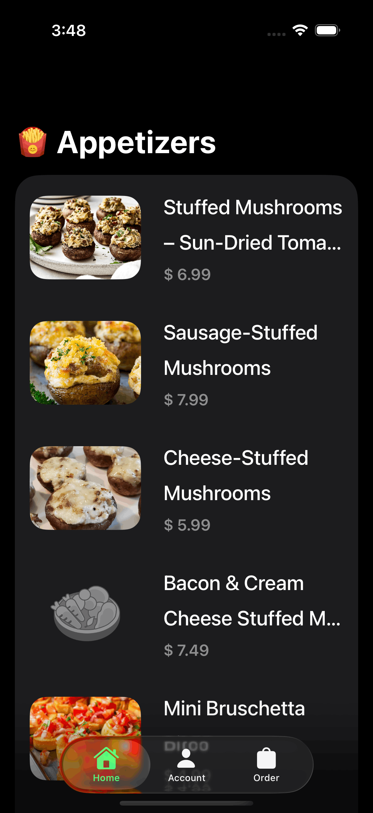
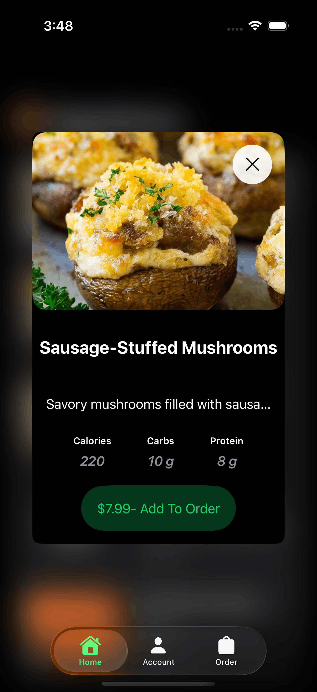
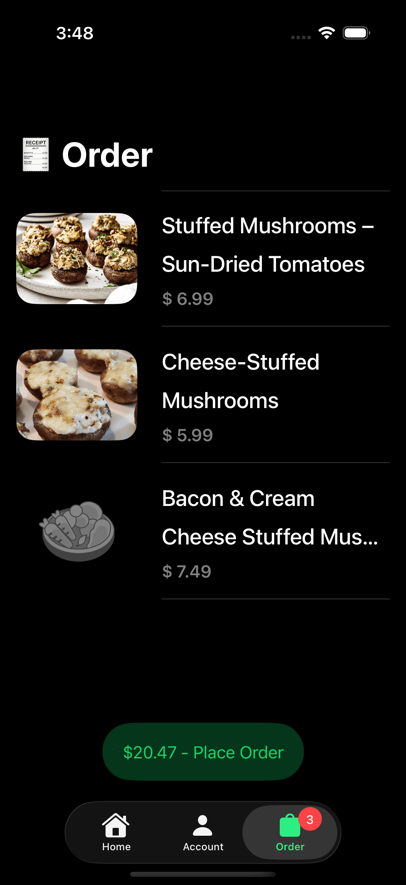
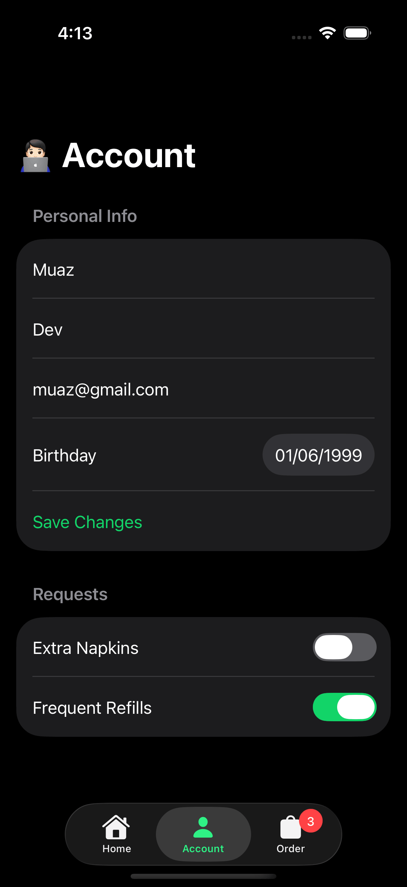

# 🍽️ Appetizers iOS App

A SwiftUI iOS app for browsing a food/appetizer menu, viewing nutritional details, managing an order, and editing account info. Built with async/await networking, a lightweight MVVM structure, and no third-party dependencies.

## ✨ Features

- **Menu browsing** — fetches a list of appetizers from a remote API and displays them with images, prices, and descriptions
- **Item details** — tap into an appetizer to see a full description and nutrition info (protein, calories, carbs)
- **Order management** — add items to an order, view the running total, and remove items; the order badge updates live on the tab bar
- **Account form** — edit personal info (name, email, birthdate) and preferences (extra napkins, frequent refills), with keyboard-aware focus handling and field validation alerts
- **Image caching** — downloaded images are cached in memory to avoid redundant network calls
- **Loading & empty states** — dedicated views for loading and empty-data scenarios

## 📱 Screenshots

| Home | Details | Order | Account |
|------|---------|-------|---------|
|  |  |  |  |

## 🛠️ Tech Stack

- **Swift 6.0** / **SwiftUI**
- **async/await** for networking (no Combine, no third-party libraries)
- **MVVM** pattern with `ObservableObject` view models
- `NSCache` for in-memory image caching
- `TabView` based navigation

## 📂 Project Structure

```
AppetizersApp/
├── Models/            # Appetizer, Order, User data models
├── Screens/
│   ├── AppetizerListView/   # Menu list + detail screens
│   ├── AccountView/         # Account form screen
│   ├── OrderView/           # Order/cart screen
│   └── AppTabView.swift     # Root tab navigation
├── Views/
│   ├── Buttons/       # Reusable buttons
│   ├── Cells/          # List/nutrition cells
│   ├── EmptyState/     # Empty state view
│   ├── Loading/        # Loading view
│   └── RemoteImage.swift    # Async image loader with caching
├── Utilities/
│   ├── Alerts/         # Error and alert models
│   ├── Extensions/     # Date & String extensions
│   └── Managers/       # NetworkManager (API calls, image downloads)
└── Assets.xcassets/    # App icons and images
```

## 🔌 API

The app fetches its appetizer data from a hosted JSON endpoint ([jsonbin.io](https://jsonbin.io)) and decodes it into `Appetizer` models. No API key or backend setup is required to run the app.

## 🚀 Getting Started

### Requirements

- Xcode (latest stable release recommended)
- iOS 26.0+ simulator or device
